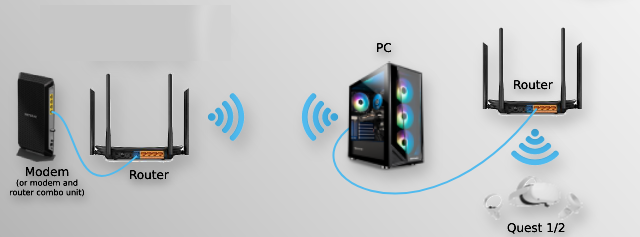
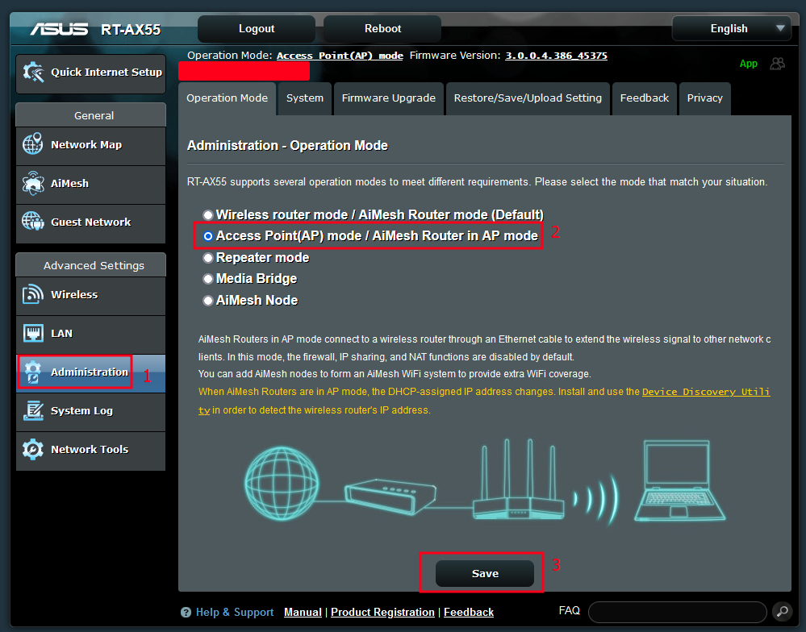
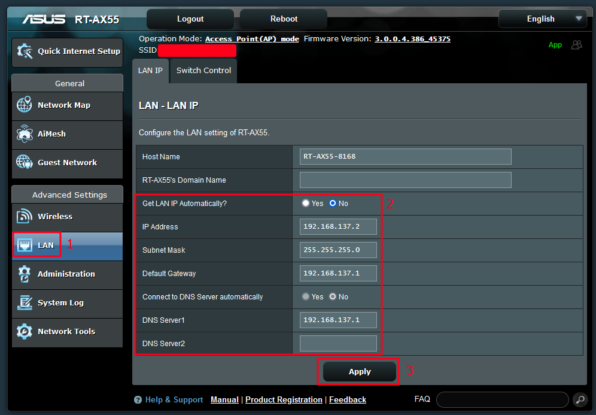
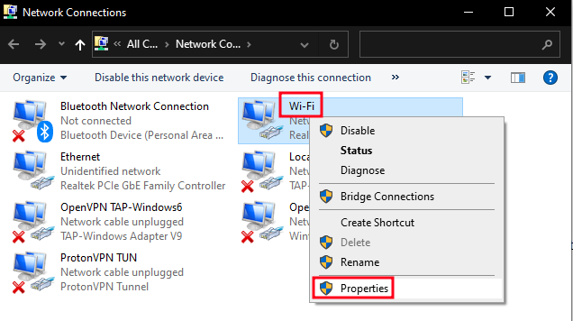
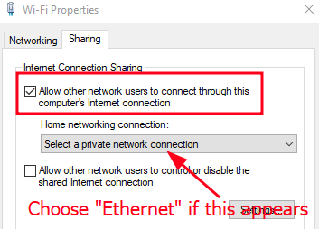

# Alternative Setup – Internet Connection Sharing

 
*Thanks to DenTechs for this example diagram*

An **"Internet Connection Sharing" (ICS) setup** is recommended when you have to use Wi-Fi to connect to the internet on your VR-ready PC, but want to use the Ethernet port on the PC with a dedicated router to get good VR performance. Windows will create a separate network and behave as a router, sharing the Wi-Fi internet connection to the ethernet port, granting the VR headset internet access. The VR stream itself will have a direct PC connection via this network, but will still be able to reach the internet.

You will need to know how to log into your dedicated router's configuration interface for this setup.

| Advantages | Disadvantages |
| --- | --- |
|  Ethernet-grade performance from your VR setup | Requires specific router LAN settings |
| VR stream will not be affected by internet traffic and vice-versa | Internet will not work on HMD when the PC is turned off |
| No need to access/change internet router settings | ICS will disable itself by default on some Windows installs, see note at bottom of guide to fix this |

## Steps
The following steps use Windows 10 and an Asus RT-AX55 for example images, but the process is similar on other routers and Win 11 setups:

1. Enable "Access Point mode" or equivalent on your VR router. If the router asks for LAN IP settings, select manual/static IP and follow the next step.  
2. Give the router the following LAN IP settings (Windows uses a fixed subnet and gateway for ICS, so these will always be the same):

|  | Setting |
| --- | --- |
| **IP** | 192.168.137.2 |
| **Subnet** | 255.255.255.0  (or /24) |
| **Gateway** | 192.168.137.1 |

3. If you weren't already using it to configure the router, you can now plug the PC Ethernet port into a LAN port on the router.

4. Go into adapter options in Windows, right click on your Internet interface (usually Wi-Fi), select Properties.  
5. Click the Sharing tab and enable "Allow other network users to connect through this computer's Internet connection". If there is a drop down, select the Ethernet interface. Click OK.  

You're done! Now when you connect your HMD to the Wi-Fi of the VR router, it will get internet access while ICS is running. You will also be able to reach the router Web UI at http://192.168.137.2/. Virtual Desktop will discover and connect to your PC normally.

**Note**: ICS will automatically, silently disable if no traffic occurs for 4 minutes or the PC is rebooted. If you have a working setup that suddenly starts saying "failed to get IP address" next time you start your headset, this is probably what happened. To get things working again, you will have to manually untick the ICS box in the adapter settings on your PC, click OK then re-tick it and click OK again to re-enable ICS.

To ensure ICS remains on indefinitely, follow the steps in this link: https://learn.microsoft.com/en-us/troubleshoot/windows-client/networking/ics-not-work-after-computer-or-service-restart